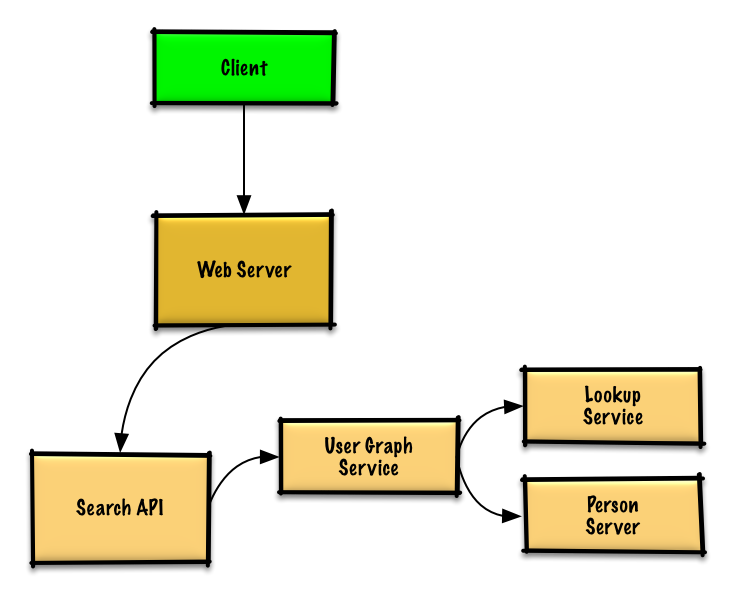

# SocialGraph

Design the data structures for a social network

## Use case
- User searches for someone and sees friends of that person

```
curl.exe http://localhost:8080/friend_search?person_id=12
```
Response
```
{
    "person_id": "100",
    "name": "foo",
    "link": "https://social.com/foo",
},
{
    "person_id": "53",
    "name": "bar",
    "link": "https://social.com/bar",
},
{
    "person_id": "1234",
    "name": "baz",
    "link": "https://social.com/baz",
},
```

- Service has high availability

## Design



## Rationale

Without the constraint of millions of users (vertices) and billions of friend relationships (edges), 
we could solve this unweighted shortest path task with a general BFS approach.

We won't be able to fit all users on the same machine, we'll need to shard users across Person Servers and access them with a Lookup Service.


### Use case

- The Client sends a request to the Web Server, running as a reverse proxy
- The Web Server forwards the request to the Search  API server
- The Search API server forwards the request to the User Graph Service
- The User Graph Service does the following:
  - Uses the Lookup Service to find the Person Server where the current user's info is stored
  - Finds the appropriate Person Server to retrieve the current user's list of friend_ids
  - Runs a BFS search using the current user as the source and the current user's friend_ids as the ids for each adjacent_node
  - To get the adjacent_node from a given id:
    - The User Graph Service will again need to communicate with the Lookup Service to determine which Person Server stores theadjacent_node matching the given id (potential for optimization)
      
## Compile
### third party

```
vcpkg install nlohmann-json:x64-windows boost-beast:x64-windows abseil:x64-windows rpclib:x64-windows
```

### compiler
VS2019 or above(C++17)

## Extension
- Load balancer for Web server
- Enable Memory Cache to reduce response time
- Store complete or partial BFS traversals to speed up subsequent lookups in the Memory Cache
- Reduce machine jumps by batching together friend lookups hosted on the same Person Server
  - Shard Person Servers by location to further improve this, as friends generally live closer to each other
- Do two BFS searches at the same time, one starting from the source, and one from the destination, then merge the two paths
- Start the BFS search from people with large numbers of friends, as they are more likely to reduce the number of degrees of separation between the current user and the search target
- Set a limit based on time or number of hops before asking the user if they want to continue searching, as searching could take a considerable amount of time in some cases
- Use a Graph Database such as Neo4j or a graph-specific query language such as GraphQL (if there were no constraint preventing the use of Graph Databases)